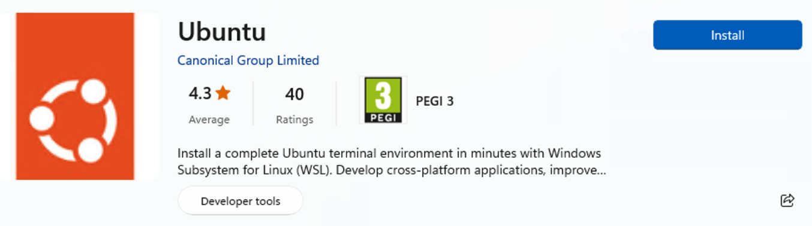
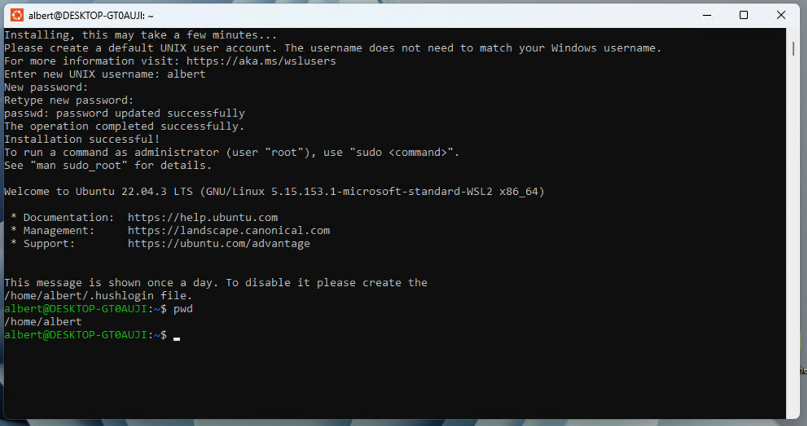
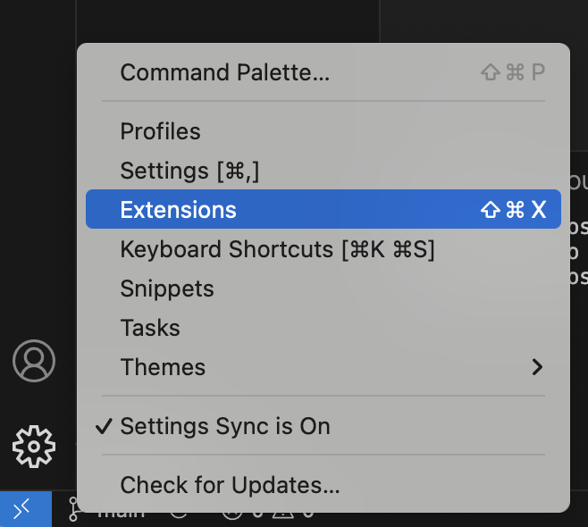

# Instal·lació

## IDEs

Un entorn de desenvolupament software (o IDE, Integrated Development Environment) és un conjunt d'eines que permeten als programadors escriure, provar i depurar codi de manera més eficient. Aquestes eines inclouen, sovint, un editor de codi, eines de compilació i depuració, gestió de versions i altres utilitats.

### Terminal/Eina de comandes
---
<center>

</center>

L'eina de comandes (també coneguda com a terminal o consola) és una interfície basada en text que permet als desenvolupadors executar ordres del sistema, gestionar fitxers, compilar codi, executar scripts i utilitzar eines de control de versions com Git. Sovint és l'eina central per interactuar amb el sistema operatiu o altres eines de programació sense interfície gràfica.

- **Linux i macOS** tenen Terminals compatibles amb UNIX

- **Windows** té diferents opcions de terminal:

    - Terminal clàssic
    - Terminal PowerShell
    - Terminal WSL Linux (necessita instal·lació apart)

A Windows, es pot instal·lar un entorn de Terminal basat amb Linux, fent ús de WSL. Per fer-ho cal instal·lar Ubuntu des de la botiga d'aplicacions:

<center>

</center>

A Windows, el primer cop que s'obre un terminal d'Ubuntu cal definir un nom d'usuari i una contrasenya.


<center>

</center>

### Visual Studio Code
---
<center>

</center>

**VS Code** és un editor de codi lleuger i extensible que proporciona una experiència IDE completa. És altament personalitzable a través d'extensions que permeten afegir funcionalitats com depuració, autocompletat de codi, suport per a múltiples llenguatges de programació i integració amb Git. VS Code és molt popular perquè equilibra potència i simplicitat.

- A **Windows** i **macOS** descarregar i instal·lar **[Visual Studio Code](https://code.visualstudio.com/download)**

- Per **linux**, cal descarregar un arxiu **.deb** i instal·lar-lo amb:

```bash
sudo apt install ./NOMARXIU.deb 
# Adaptar al nom, per exemple: code_1.92.2-172.deb
```

### GitHub Desktop
---
<center>

</center>

GitHub és una plataforma de control de versions basada en Git que permet als desenvolupadors col·laborar en projectes, gestionar versions de codi, revisar canvis i compartir projectes públicament o privadament. 

- A **Windows** i **macOS** descarregar i instal·lar **[GitHub Desktop](https://desktop.github.com/download/)**

- Per **linux**, GitHub Desktop s'instal·la des del **Terminal** amb aquestes 3 comandes:
 
```bash
wget -qO - https://apt.packages.shiftkey.dev/gpg.key | gpg --dearmor | sudo tee /usr/share/keyrings/shiftkey-packages.gpg > /dev/null

sudo sh -c 'echo "deb [arch=amd64 signed-by=/usr/share/keyrings/shiftkey-packages.gpg] https://apt.packages.shiftkey.dev/ubuntu/ any main" > /etc/apt/sources.list.d/shiftkey-packages.list'

sudo apt update && sudo apt install github-desktop
```

### Extensió 'Live Preview'

Intal·la l'extensió *"Live Preview"* de *"Visual Studio Code"*. A l'apartat **Extensions**:

<center>

</center>

Buscar i instal·lar l'extensió:

<center>

</center>

### XmlLint

Instal·lar 'XmlLint' a Ubuntu:

```bash
sudo apt update
sudo apt install libxml2-utils
xmllint --version
```