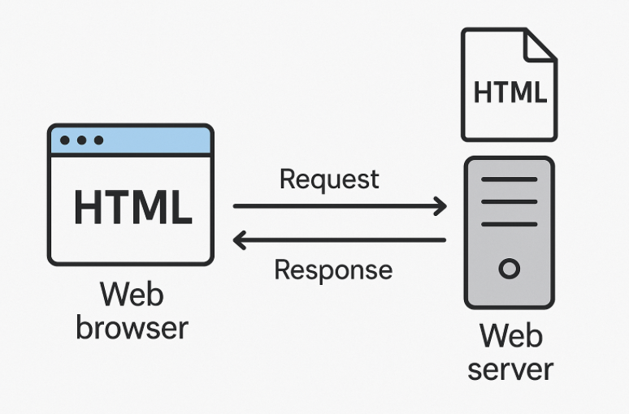
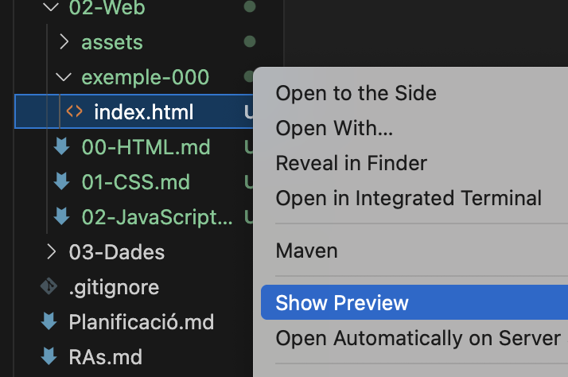
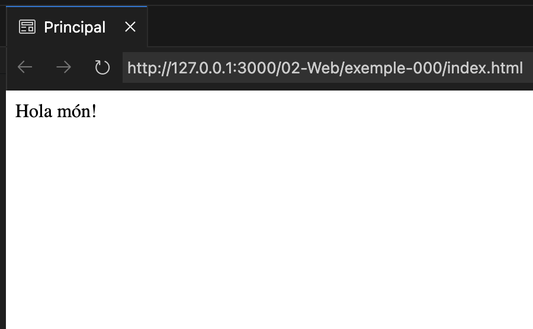
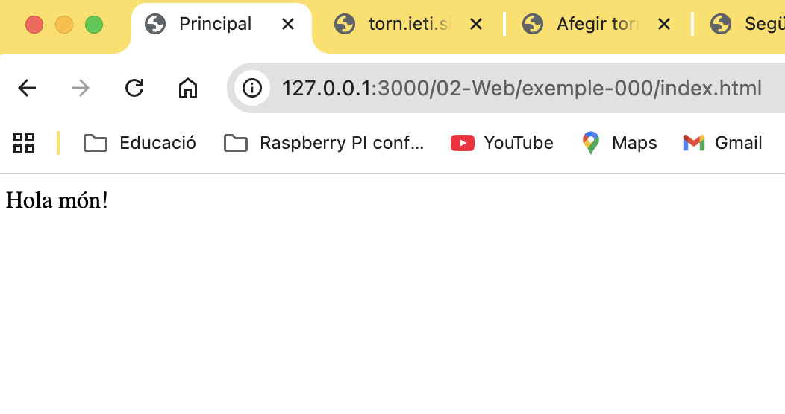

# HTML

## Funcionament de la web


**Petició**: Els navegadors demanen informació a un servidor (a través d'una direcció URL)

**Resposta**: El servidor respon retornant informació als navegadors

<center>

</center>

Per desenvolupar pàgines web, necessitem per tant un servidor. De moment fem servir l'extensió **"Live Preview"** que posa un servidor en funcionament dins del **Visual Studio Code**.

A la carpeta "exemple-000", a l'arxiu "index.html" escollir la opció **"Show Preview"** per veure la pàgina web.

## Arxius més habituals

**.html**: Defineix els continguts de la pàgina web (HTML5)

**.css**: Defineix l’estètica de la pàgina web (CSS3)

**.js**: Defineix la interactivitat de la pàgina web (Javascript)

**.png**: Un arxiu d'imatge

**.svg**: Un dibuix vectorial

## Arxius i carpetes

Els servidors permeten configurar com s’organitzen les carpetes, però habitualment:

Carpeta **‘html’** o **‘public’** serveixen continguts estàtics, tal i com estan els arxius al disc.

**Nota**: Els continguts estàtics són els que no canvien i són iguals per tots els usuaris, no es personalitzen.

Normalment l'arxiu principal s'anomena **"index.html"**, i es serveix per defecte.

**Parts de les rutes**

Les rutes dels arxius tenen dues parts:

- **La base** d'on penjen tots els arxius del servidor
- **La ruta** dins l'estructura de carpetes i arxius que publica el servidor

```text
Base que veu l'usuari (direcció del servidor): 

    https://servidor.abc

Base on estàn els arxius del servidor:

    /home/user/www/public

Ruta des de la base fins als arxius:

    /fotos/animal.png
    /estils/tipografies.css
    /jugadors.html
```

**Exemples:**

Si l'usuari identifica la base del servidor com:
```text
https://servidor.abc/
```
L'arrel física del nostre servidor està a la carpeta:
```text
/home/user/www/public/
```
I en aquesta carpeta hi ha un arxiu "index.html"
```text
/home/user/www/public/index.html
```
La direcció de la pàgina 'index.html' serà:
```text
https://servidor.abc/
```
Si tenim una imatge dins la carpeta 'fotos':
```text
/home/user/www/public/fotos/animal.png
```
La direcció d'aquesta foto serà:
```text
https://servidor.abc/fotos/animal.png
```

## Veure una pàgina web

Per veure una pàgina web, necessitem un servidor.

L'extensió **"Live Preview"** permet posar un servidor en funcionament de manera fàcil.

Amb l'arxiu "02-Web/exemple-000/index.html", escollir la opció  "Show Preview"

<center>

</center>

Es posarà en funcionament el servidor, i veurem la pàgina web al *Visual Studio*:

<center>

</center>

Veiem que les direccions són:

La base amb la que l'usuari identifica el servidor:
```text
http://127.0.0.1:3000/
```
L'arrel física del servidor és la del projecte
```text
./
```
La direcció de la pàgina dins del servidor:
```text
./02-Web/exemple-000/index.html
```
A més, podem obrir la mateixa URL amb un navegador i veurem la mateixa pàgina:

<center>

</center>

# Llenguatge HTML

HTML és un **llenguatge de marques** que defineix l’estructura de documents **.html** (pàgines web)

Dit d'una altra manera:

```text
El llenguatge HTML permet definir els textos i imatges que es veuen en una pàgina web, com estàn disposats i el seu estil. A partir d'una descripció textual.
```

```html
<!DOCTYPE html>
<html xmlns="http://www.w3.org/1999/xhtml">
   <head>
       <meta charset="UTF-8">
       <title>Principal</title>
   </head>
   <body>
       Hola món!
   </body>
</html>
```

Els documents **.html** es composen d'elements *(tags)* que s'escriuen entre caracters **&lt;** i **&gt;**.

Hi ha molts tipus d'elements, i cada un té una funció especial. 

Hi ha documentació sobre els elements a la pàgina oficial de **Mozilla**:

[Documentació elements HTML](https://developer.mozilla.org/en-US/docs/Web/HTML/Reference/Elements)

En una pàgina web, l'element principal és el **<html>**

```html
<!DOCTYPE html>
<html xmlns="http://www.w3.org/1999/xhtml">
</html>
```

**&lt;!DOCTYPE html&gt;**: informa que el nostre arxiu de text, és un document amb informació tipus **HTML**

**&lt;html&gt;**: és l'element principal de la pàgina, dins trindrà tots els altres elements.

## Elements HTML

Hi ha dos tipus d'elements:

**Elements buits** (self-closing): Són els que no tenen informació a dins, i es tanquen amb **"/"**
```html

```

**Elements contenidors** (non-void): Són els que tenen informació dins, es tanquen amb **&lt;/nom&gt;**
```html
<div>
    <h1>Títol Gran</h1>
    <p>Paràgraf</p>
</div>
```

Els elements contenidors, poden tenir altres elements dins, o text.

### Atributs dels elements

Els **atributs** són informació addicional que afegeixes dins de l’etiqueta d’un element HTML per indicar-li propietats o configuracions.

**Exemples**:

```html
<link rel="stylesheet" href="estil.css">
```

En aquest cas l'element **link** té els atributs **rel** i **href** amb valors:

- **rel** té el valor *stylesheet*
- **href** té el valor *estil.css*

```html

```

En aquest cas l'element **img** té els atributs **src**, **alt** i **width** amb valors:

- **src** té la ruta de la imatge que es vol mostrar *fotos/gos.png*
- **alt** té el text que descriu la imatge per les persones sense visió
- **width** té la mida d'ample en pixels que ocuparà la imatge a la pàgina web

## Elements HTML bàsics

**&lt;html&gt;**: és l'element principal de la pàgina, dins trindrà tots els altres elements.

**&lt;html&gt;**: és l'element principal de la pàgina, dins trindrà tots els altres elements.

**&lt;head&gt;**: capçalera del document, amb informació sobre el document

**&lt;meta&gt;**: informació extra per poder processar el document

**&lt;title&gt;**: títol del document, normalment apareix a la pestanya del navegador

**&lt;body&gt;**: cos del document, amb els elements de la pàgina web

```html
<!DOCTYPE html>
<html xmlns="http://www.w3.org/1999/xhtml">
   <head>
       <meta charset="UTF-8">
       <title>Principal</title>
   </head>
   <body>
       Hola món!
   </body>
</html>
```

**Nota**: El format "UTF-8" permet guardar caràcters especials de tot el món, i és el que fa que les pàgines web siguin compatibles i facin servir emojis. 

**Exemple** de caràcters especials en UTF-8:

- Català: peix (🐟)
- Hebreu: דג (dag)
- Àrab: سمك (samak)
- Xinès (mandarí): 鱼 (yú)
- Japonès: 魚 (sakana o bé uo)

## Elements HTML importants

**&lt;div&gt;**: contenidor genèric que ajuda posicionar i agrupar altres elements.

**&lt;br/&gt;** (break): mostra un salt horitzontal entre elements

**&lt;hr/&gt;** (horiztonal rule): mostra una linia horitzontal separadora

**&lt;h1&gt;, &lt;h2&gt;**, ...: diferents nivells de títol

**&lt;p&gt;** paràgraf de text

**&lt;b&gt;**: marcar un text amb negreta

**&lt;strong&gt;**: marcar un com a important, normalment es veu en negreta

**&lt;i&gt;**: marcar un text amb cursiva

**&lt;em&gt;**: marcar un text amb ènfasi, normalment es veu en cursiva

**&lt;img&gt;**: mostrar una imatge

**&lt;a&gt;**: enllaçar amb una altre pàgina web

**Exemple-001**: Obrir amb "Show preview" la pàgina "02-Web/exemple-001/index.html"

## Llistes HTML

Les **llistes** serveixen per mostrar informació agrupada en forma d’elements ordenats o desordenats.

Hi ha dos tipus principals:

### Llistes desordenades (`<ul>`)
- Fan servir punts o vinyetes.
- Es defineixen amb l’element **`<ul>`** (*unordered list*).
- Cada element de la llista s’escriu amb **`<li>`** (*list item*).

**Exemple**:
```html
<ul>
   <li>Poma</li>
   <li>Plàtan</li>
   <li>Taronja</li>
</ul>
```

### Llistes ordenades (`<ol>`)

- Fan servir números automàtics.
- Es defineixen amb l’element `<ol>` (ordered list).
Cada element de la llista també s’escriu amb `<li>`.

```html
<ol>
    <li>Gos</li>
    <li>Gat</li>
    <li>Peix</li>
</ol>
```

**Exemple-002**: Obrir amb "Show preview" la pàgina "02-Web/exemple-002/index.html"

## Enllaços HTML

Els **enllaços** (links) serveixen per connectar una pàgina web amb una altra, o amb un recurs (imatge, document, vídeo, etc.).

L’element que s’utilitza és **`<a>`** (*anchor*).

### Atributs principals

- **`href`** (*hypertext reference*): indica la direcció (URL o arxiu) on porta l’enllaç.  
- **`target`**: opcional, indica com s’obre l’enllaç:
  - `_self`: (per defecte) obre l’enllaç a la mateixa pestanya.
  - `_blank`: obre l’enllaç en una pestanya nova.

**Exemple bàsic**:

```html
<a href="https://www.wikipedia.org">Visita la Viquipèdia</a>
```

**Enllaços externs**

- Són els que porten a una altra web fora del nostre servidor.
- Sempre fan servir una **URL completa** (amb `http://` o `https://`).

**Enllaços interns**
- Són els que porten a un arxiu dins del mateix servidor o la mateixa carpeta del projecte.
- Es poden escriure amb rutes relatives `./pagina.html`

**Nota**: Dins d'un element `<a>`s'hi poden posar altres elements, com imatges o bé textos:
```html
<a href="https://ca.wikipedia.org/wiki/Dinosaures" target="_blank">
    
    <br/>
    Pàgina de dinosaures a la Viquipèdia, en una nova pestanya
</a>
```

**Exemple-003**: Obrir amb "Show preview" la pàgina "02-Web/exemple-003/index.html"
